# RNA-seq分析

## 0. 介绍

```
    read                                     ----
*   read              ----                 ----
*   read             ----                 ----
*   read      :    ----       ----       ----
+   genome    : =======================================
+   annotation:   |-gene1-|  |-gene2-|  |-gene3-|
```

+ 分析流程的结构是(仿照[`Tom Battaglia`](https://github.com/twbattaglia))

```bash
      database                   Workflow                        tools
======================================================================================
  
+=================+     +-------------------------+                               
|     database    |     |      Quality Analysis   |---------------> fastqc 
+=================+     +-------------------------+                                
|+------+         |                 v                                      
|| rRNA |---------|--+  +-------------------------+
|+------+         |  |  | Base Quality Filtering  |------------> TrimGalore
|  +------+       |  |  +-------------------------+
|  |genome|-------|-+|              v
|  +------+       | ||  +-------------------------+
|     +----------+| |+->| rRNA Sequence Filtering |------------> SortMeRNA
|     |  Genome  || |   +-------------------------+
|     |Annotation|| |               v
|     +----------+| |   +-------------------------+
|          |      | +-->|   Genome Alignment      |------------> hisat2
+----------|------+     +-------------------------+
           |                        v
           |            +-------------------------+
           +----------->|  Count Mapped Reads     |------------> HTseq
                        +-------------------------+
                                    v
                        +-------------------------+
                        | Differential Expression |------------> DESeq2
                        +-------------------------+
                                    v
                        +-------------------------+
                        |     Pathway analysis    |------------> ClusterProfiler
                        +-------------------------+
```

## 1. 前期准备

在进行数据处理之前，需要将大致的目录生成好，这样一来将数据存放的位置有序一些，便于查看，二来在程序运行的时候能够更加方便的明确填写文件路径。将后面可能会用到的文件存放的文件夹大致拟定一下，便于自己理解和查找文件，这里不需要将后面所有可能用到的文件夹都新建，只是建立一个整体的文件夹的目录结构就行了。这样层级清晰，可以防止出错，在某种程序上提高了效率节省时间。

```bash
# 首先定位到自己这个用户的位置
cd ~

# 新建一个biosoft文件夹用于存放生物软件工具
mkdir biosoft
```
```
# 新建一个项目文件夹其中包含大鼠的文件夹
mkdir -p project/rat

# 进入
cd project/rat

# 将今后各个文件需要存放的文件夹可以事先拟定一下
mkdir annotation genome sequence output script
```

| 文件夹名 | 说明 |
| ---| --- |
| annotation | 存放注释文件(.gff .bed .gff3) |
| genome | 存放基因组与索引文件(.fa .bt)|
| sequence | 存放测序数据(.fastq.gz) |
| output | 存放各种处理的输出文件 |
| script | 存放脚本的位置 |

使用`tree`命令看一下我们设置的目录结构

```bash
# 首先进入大鼠的项目文件夹中
$ cd ~/project/rat

$ tree

.
├── annotation  用于存放大鼠的基因组注释信息(.gff/gtf)
├── genome      用于存放大鼠的基因组数据(.fasta)
├── output      用于存放处理后的数据
├── script      用于部分脚本
└── sequence    用于存放测序原始数据
```

## 2. 工具下载

### 2.0 conda

conda可以很方便的安装和管理生信相关的工具

```bash
# 下载文件
wget https://repo.continuum.io/miniconda/Miniconda3-latest-MacOSX-x86_64.sh -O ~/miniconda.sh

# 安装
bash miniconda.sh

# 配置
conda config --add channels conda-forge
conda config --add channels defaults
conda config --add channels r
conda config --add channels bioconda
```
建立python3.6的环境 

```bash
conda create python36 python=3.6
```

### 2.1 sratoolkit

sra是NCBI的用于下载数据以及转化数据使用

```bash
$ cd ~/biosoft
# mac
$ wget https://ftp-trace.ncbi.nlm.nih.gov/sra/sdk/2.9.6-1/sratoolkit.2.9.6-1-mac64.tar.gz
$ tar -xzvf sratoolkit.2.9.6-1-mac64.tar.gz
$ mv sratoolkit.2.9.6-1-mac64 sratoolkit.2.9.6
$ cd sratoolkit.2.9.6/bin

# 导入临时环境变量
$ export PATH="$(pwd):$PATH"
$ prefetch --help
```

### 2.2 fastqc

对测序文件质量控制

|     | 站点 |
| --- | --- |
| 官网 | http://www.bioinformatics.babraham.ac.uk/projects/fastqc/ |
| 手册 | http://www.bioinformatics.babraham.ac.uk/projects/fastqc/Help/ |
| 中文解释 | https://www.plob.org/article/5987.html |


```bash
cd ~/biosoft
wget https://www.bioinformatics.babraham.ac.uk/projects/fastqc/fastqc_v0.11.7.zip
unzip fastqc_v0.11.7.zip
cd FastQC

# 导入临时环境变量
export PATH="$(pwd):$PATH"

# 测试是否能运行
fastqc --help
```
### 2.3 multiqc

将fastqc的统计结果汇聚成一个网页可视化文件，便于查看

|      | 站点 |
| --- | --- |
| 官网 |  https://multiqc.info/ |
| 文档 | https://multiqc.info/docs/ |
| 中文解读 | http://fbb84b26.wiz03.com/share/s/3XK4IC0cm4CL22pU-r1HPcQQ1iRTvV2GwkwL2AaxYi2fXHP7 |

```bash
# 使用python的安装器安装
pip install multiqc
```
### 2.4 cutadapt

用于去除测序接头

|      | 站点 |
| --- | --- |
| 手册 | https://cutadapt.readthedocs.io/en/stable/guide.html |

```bash
conda activate python36
pip install cutadapt
conda deactivate
```
### 2.5 trimmomatic

trimmomatic是一款多线程命令行工具，可以用来修剪Illumina (FASTQ)数据以及删除接头，是目前使用最多的高通量测序数据清洗的工具。

|   | 站点 |
| --- | --- |
| 官网 |  http://www.usadellab.org/cms/index.php?page=trimmomatic |
| 手册 | http://www.usadellab.org/cms/uploads/supplementary/Trimmomatic/TrimmomaticManual_V0.32.pdf |
| 中文解读 |  |


```bash
cd ~/biosoft
wget http://www.usadellab.org/cms/uploads/supplementary/Trimmomatic/Trimmomatic-0.38.zip
unzip Trimmomatic-0.38.zip

cd Trimmomatic-0.38

# 导入临时环境变量
export PATH="$(pwd):$PATH"
```
### 2.6 hisat2

作为bowtie2和tophat的继任者，它在RNA-seq中使用较多。

|        | 站点 |
| --- | --- |
| 官网 | https://ccb.jhu.edu/software/hisat2/index.shtml |
| 手册 | https://ccb.jhu.edu/software/hisat2/manual.shtml |

+ 首先用浏览器进入`hisat2`[官网](https://ccb.jhu.edu/software/hisat2/index.shtml)

+ 在右侧有对应的不同系统的安装版本，根据自己的系统进行选择

| version 2.1.0 | 6/8/2017 |
| --- | --- |
| [   Source code](http://ccb.jhu.edu/software/hisat2/dl/hisat2-2.1.0-source.zip) |
| [   Linux x86_64 binary](http://ccb.jhu.edu/software/hisat2/dl/hisat2-2.1.0-Linux_x86_64.zip) |
| [   Mac OS X x86_64 binary](http://ccb.jhu.edu/software/hisat2/dl/hisat2-2.1.0-OSX_x86_64.zip) |
| [   Windows binary](http://www.di.fc.ul.pt/~afalcao/hisat2_windows.html) |

另外是参考文献

Kim D, Langmead B and Salzberg SL. [**HISAT: a fast spliced aligner with low memory requirements**](http://www.nature.com/nmeth/journal/vaop/ncurrent/full/nmeth.3317.html). _[Nature Methods](http://www.nature.com/nmeth)_2015


+ 这里我们选择`Mac OS X`的，对着[Mac OS X x86_64 binary](http://ccb.jhu.edu/software/hisat2/dl/hisat2-2.1.0-OSX_x86_64.zip)右键，复制链接地址目

+ 回到终端上来：

```bash
# 下载
$ cd ~/biosoft/
$ wget http://ccb.jhu.edu/software/hisat2/dl/hisat2-2.1.0-OSX_x86_64.zip

# 解压缩
$ unzip hisat2-2.1.0-OSX_x86_64.zip
$ cd hisat2-2.1.0

# 导入临时环境变量
$ export PATH="~/biosoft/hisat2-2.1.0:$PATH"

# 测试是否可用
$ hisat2 -h
```
### sortmerna

在RNA测序中有很多是rRNA，sortmerna是一款将高通量的测序中的rRNA进行剔除的软件

|   |  站点 |
| --- | --- |
| 官网 | https://bioinfo.lifl.fr/RNA/sortmerna/ |
| 手册 | https://bioinfo.lifl.fr/RNA/sortmerna/code/SortMeRNA-user-manual-v2.1.pdf |
| github | https://github.com/biocore/sortmerna/blob/master/README.md |
| 中文解读 | https://www.jianshu.com/p/6b7a442d293f |


```bash
$ cd ~/biosoft/

# 下载软件
$ wget https://github.com/biocore/sortmerna/archive/2.1.tar.gz -O sortmerna-2.1.tar.gz

# 解压
$ tar -xzvf sortmerna-2.1.tar.gz
$ cd sortmerna-2.1

# 配置相关信息
$ ./configure --prefix=$PWD

# 编译
$ make -j 4

# 查看是否成功
$ ./sortmerna --help

# 导入到环境变量
$ export PATH="$(pwd):$PATH"

# 把数据库文件移动到能找到的地方
$ mv ./rRNA_databases/ ~/database/sortmerna_db/rRNA_databases

# 相关库文件
$ cd ~/database/rRNA_databases
$ sortmerna_ref_data=$(pwd)/rRNA_databases/silva-bac-16s-id90.fasta,$(pwd)/index/silva-bac-16s-db:\
$(pwd)/rRNA_databases/silva-bac-23s-id98.fasta,$(pwd)/index/silva-bac-23s-db:\
$(pwd)/rRNA_databases/silva-arc-16s-id95.fasta,$(pwd)/index/silva-arc-16s-db:\
$(pwd)/rRNA_databases/silva-arc-23s-id98.fasta,$(pwd)/index/silva-arc-23s-db:\
$(pwd)/rRNA_databases/silva-euk-18s-id95.fasta,$(pwd)/index/silva-euk-18s-db:\
$(pwd)/rRNA_databases/silva-euk-28s-id98.fasta,$(pwd)/index/silva-euk-28s-db:\
$(pwd)/rRNA_databases/rfam-5s-database-id98.fasta,$(pwd)/index/rfam-5s-db:\
$(pwd)/rRNA_databases/rfam-5.8s-database-id98.fasta,$(pwd)/index/rfam-5.8s-db

# 真核生物的rRNA不需要那么多(5s, 5.8s, 18s, 28s)
$ euk_rNRA_ref_data=$(pwd)/rRNA_databases/silva-euk-18s-id95.fasta,$(pwd)/index/silva-euk-18s-db:\
$(pwd)/rRNA_databases/silva-euk-28s-id98.fasta,$(pwd)/index/silva-euk-28s-db:\
$(pwd)/rRNA_databases/rfam-5s-database-id98.fasta,$(pwd)/index/rfam-5s-db:\
$(pwd)/rRNA_databases/rfam-5.8s-database-id98.fasta,$(pwd)/index/rfam-5.8s-db

# 建立数据库索引
$ indexdb_rna --ref $data
```

### 2.7 samtools

比对得到的sam或者bam文件的各种操作

|   |  站点 |
| --- | --- |
| 官网 | http://www.htslib.org/ |
| 手册 | http://quinlanlab.org/tutorials/samtools/samtools.html |
| 中文解读 | https://www.jianshu.com/p/6b7a442d293f |

samtools是对比对后得到的文件进行格式转化处理合并等操作的工具。

```bash
$ cd ~/biosoft

# 下载
$ wget -c https://github.com/samtools/samtools/releases/download/1.9/samtools-1.9.tar.bz2

# 解压
$ tar jxvf samtools-1.9.tar.bz2
$ cd samtools-1.9

# 配置信息
$ ./configure --prefix=$(pwd)

# 开始编译
$ make -j 4

# 导入临时环境变量
$ export PATH="$(pwd):$PATH"
```
### 2.8 HTseq

对比对后的文件进行read计数

```bash
$ conda activate python36
$ pip install HTseq
$ conda deactivate
```
### 2.9 R

- 官网：https://www.r-project.org

R语言中集合了多种生物信息学的分析工具，其中RNA-seq分析的工具更是丰富，R语言最擅长统计学分析，这里在后续的基因表达量分析，差异分析以及作图时候会用到

- 下载

点击左上角`CRAN`，往下拉找到`china`的站点，就选第一个[清华的站点](https://mirrors.tuna.tsinghua.edu.cn/CRAN/)，点击进去，之后最上面有三个对应系统的安装包，按照自己的系统下载，这里点击[Mac OS](https://mirrors.tuna.tsinghua.edu.cn/CRAN/bin/macosx/)，点击[R-3.6.1.pkg](https://mirrors.tuna.tsinghua.edu.cn/CRAN/bin/macosx/R-3.6.1.pkg)就开始下载了，下载之后双击安装包安装。

### 2.10 Rstudio

因为R自身带的界面使用起来不是特别方便和美观，这里使用Rstudio来对R的显示效果进行提升，除此之外还有其他功能。

进入网站：https://www.rstudio.com/products/rstudio/download/

点击`RStudio Desktop Open Source License` 下面的`DOWNLOAD`，之后选择对应的版本的，这里选择`MAC OS`版本[RStudio 1.2.1335 - Mac OS X 10.12+ (64-bit)](https://download1.rstudio.org/desktop/macos/RStudio-1.2.1335.dmg) 下载完成之后双击安装。

**注意**：安装完成`R`之后再安装`Rstudio`

### 2.11 parallel

parallel是进行多线程运行的工具，并行运行可以提升效率，节省时间

```bash
$ brew install parallel
```

### StringTie

能够应用流神经网络算法和可选的de novo组装进行转录本组装并预计表达水平。与Cufflinks等程序相比，StringTie实现了更完整、更准确的基因重建，并更好地预测了表达水平。

|  | 站点 |
| --- | --- |
| 官网 | http://ccb.jhu.edu/software/stringtie/ |
| 手册 | http://ccb.jhu.edu/software/stringtie/index.shtml?t=manual |
| 中文解读 | https://www.plob.org/article/12865.html |

+ 安装

```bash
$ cd ~/biosoft

$ wget http://ccb.jhu.edu/software/stringtie/dl/stringtie-1.3.6.OSX_x86_64.tar.gz

$ tar -xzvf stringtie-1.3.6.OSX_x86_64.tar.gz
$ mv stringtie-1.3.6.OSX_x86_64 stringtie-1.3.6
$ cd stringtie-1.3.6

$ export PATH="$(pwd):$PATH"

$ stringtie --help
```
### Ballgown

是R语言中基因差异表达分析的工具，能利用RNA-Seq实验的数据(StringTie, RSEM, Cufflinks)的结果预测基因、转录本的差异表达。

+ 安装

```R
source("http://bioconductor.org/biocLite.R")
biocLite("Ballgown")
```

## 3. 数据下载

这里使用大鼠的测序数据作为测试。

大鼠又叫大白鼠（Rat，Rattus norvegicus），是非常重要的模式生物之一，因为其与人类之间存在高度的同源性、优良的品系资源，被广泛应用于毒理学、神经病学，细胞培养等研究中。在`ENSEMBL`和`UCSC`中均有其基因组数据。

### 3.1 参考数据

下载基因组序列，有两个地方可以去找到大鼠的基因组

#### Ensembl

+ 1. 首先下载基因组数据

进入ENSEMBL网站，在左侧`All genomes`中，选择物种`Rat`，之后页面会自动跳转到大鼠的页面，首先点击左侧[Download DNA sequence (FASTA)](ftp://ftp.ensembl.org/pub/release-97/fasta/rattus_norvegicus/dna/) 进入基因组序列数据的下载地址，其次点击右侧的[Download GTF](ftp://ftp.ensembl.org/pub/release-97/gtf/rattus_norvegicus/) or [GFF3](ftp://ftp.ensembl.org/pub/release-97/gff3/rattus_norvegicus/) files for genes, cDNAs, ncRNA, proteins，这里就点击`GFF`的

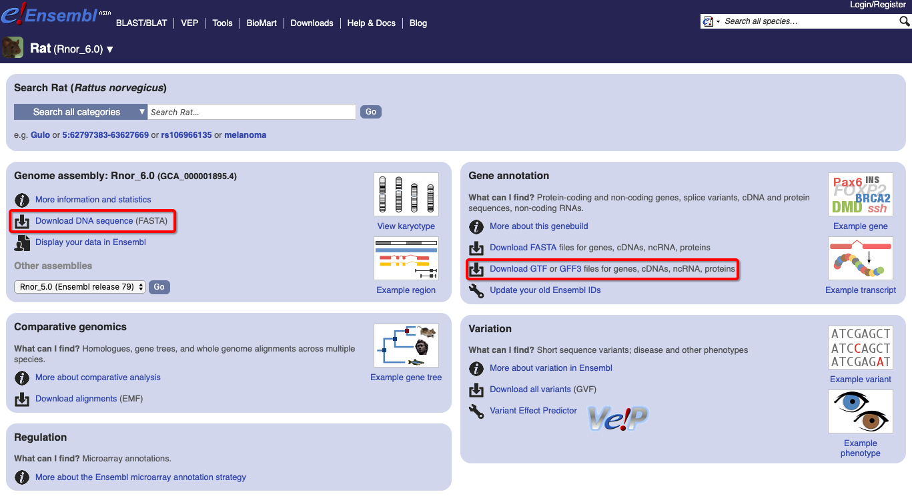

下面是具体的命令行下载代码：

**下载**

```bash
$ cd ~/project/rat/genome
$ wget ftp://ftp.ensembl.org/pub/release-97/fasta/rattus_norvegicus/dna/Rattus_norvegicus.Rnor_6.0.dna.toplevel.fa.gz
$ gzip -d Rattus_norvegicus.Rnor_6.0.dna.toplevel.fa.gz
```
目前大鼠的基因组测序版本到了`6`，这里为了后面方便操作，改名为`rn6`
```
# 改名（方便后面使用，名字太长一来不方便输入，二来可能会输错）
$ mv Rattus_norvegicus.Rnor_6.0.dna.toplevel.fa rn6.fa
```
下载得到的基因组文件可以查看一下包含哪些染色体，确认文件是否下载正确。

```bash
cat rn6.fa | grep "^>" 
```
可以看到除了`1-20`号+`X`+`Y`+`MT`之外还有很多别的ID名。这些都是`scaffold`
```
>1 dna:chromosome chromosome:Rnor_6.0:1:1:282763074:1 REF
>2 dna:chromosome chromosome:Rnor_6.0:2:1:266435125:1 REF
>3 dna:chromosome chromosome:Rnor_6.0:3:1:177699992:1 REF
>4 dna:chromosome chromosome:Rnor_6.0:4:1:184226339:1 REF
>5 dna:chromosome chromosome:Rnor_6.0:5:1:173707219:1 REF
>6 dna:chromosome chromosome:Rnor_6.0:6:1:147991367:1 REF
>7 dna:chromosome chromosome:Rnor_6.0:7:1:145729302:1 REF
>8 dna:chromosome chromosome:Rnor_6.0:8:1:133307652:1 REF
>9 dna:chromosome chromosome:Rnor_6.0:9:1:122095297:1 REF
>10 dna:chromosome chromosome:Rnor_6.0:10:1:112626471:1 REF
>11 dna:chromosome chromosome:Rnor_6.0:11:1:90463843:1 REF
>12 dna:chromosome chromosome:Rnor_6.0:12:1:52716770:1 REF
>13 dna:chromosome chromosome:Rnor_6.0:13:1:114033958:1 REF
>14 dna:chromosome chromosome:Rnor_6.0:14:1:115493446:1 REF
>15 dna:chromosome chromosome:Rnor_6.0:15:1:111246239:1 REF
>16 dna:chromosome chromosome:Rnor_6.0:16:1:90668790:1 REF
>17 dna:chromosome chromosome:Rnor_6.0:17:1:90843779:1 REF
>18 dna:chromosome chromosome:Rnor_6.0:18:1:88201929:1 REF
>19 dna:chromosome chromosome:Rnor_6.0:19:1:62275575:1 REF
>20 dna:chromosome chromosome:Rnor_6.0:20:1:56205956:1 REF
>X dna:chromosome chromosome:Rnor_6.0:X:1:159970021:1 REF
>Y dna:chromosome chromosome:Rnor_6.0:Y:1:3310458:1 REF
>MT dna:chromosome chromosome:Rnor_6.0:MT:1:16313:1 REF
>KL568162.1 dna:scaffold scaffold:Rnor_6.0:KL568162.1:1:10937627:1 REF
>KL568139.1 dna:scaffold scaffold:Rnor_6.0:KL568139.1:1:9752924:1 REF
>KL568161.1 dna:scaffold scaffold:Rnor_6.0:KL568161.1:1:7627431:1 REF
...
```
这里看到每一条染色体的名称后面还跟了一些描述信息，这些描述信息就是当前组装版本，长度等等信息，但是这个信息会妨碍后面写脚本统计或者一些分析，所以这里最好去掉

```bash
# 首先将之前的名称更改一下
$ mv rn6.fa rn6.raw.fa

# 然后去除染色体编号后的描述信息
$ cat rn6.raw.fa | perl -n -e 'if(m/^>(.+?)(?:\s|$)/){ print ">$1\n";}else{print}' > rn6.fa

# 删除
$ rm rn6.raw.fa
```
+ 可以使用脚本统计每一条染色体的长度

```bash
$ cat rn6.fa | perl -n -e '
    s/\r?\n//;
    if(m/^>(.+?)\s*$/){
        $title = $1;
        push @t, $title;
    }elsif(defined $title){
        $title_len{$title} += length($_);
    }
    END{
        for my $title (@t){
            print "$title","\t","$title_len{$title}","\n";
        }
    }
'
```
长度

```
1	282763074
2	266435125
3	177699992
4	184226339
5	173707219
6	147991367
7	145729302
8	133307652
9	122095297
10	112626471
11	90463843
12	52716770
13	114033958
14	115493446
15	111246239
16	90668790
17	90843779
18	88201929
19	62275575
20	56205956
X	159970021
Y	3310458
MT	16313
KL568162.1	10937627
KL568139.1	9752924
KL568161.1	7627431
...
```
这里为了方便演示，直接用1号染色体的基因组

```bash
$ cat rn6.fa | perl -n -e '
  if(m/^>/){
    if(m/>1$/){
      $title = 1;
    }else{
      $title = 0;
    }
  }else{
    push @s, $_ if $title;
  }
  END{
    printf ">1\n%s", join("", @s);
  }
' > rn6.chr1.fa
```
> **基因组数据说明**
> 
> 基因组数据的格式为`.fasta`，这个格式是一种简单明了的格式，格式为：
> ```
> >seq_id
> AGCTGAGCTAGCTACGGAGCTGAC
> ACGACTGATCTGACGTTGATCGTT
> ```
> 文件中以`>`开头的是序列的名称，下面接着的`ATGC`是这条序列信息，基因组`fasta`文件记录大鼠的所有的被测得的染色体的序列信息，目前已经更新到`version 6` ，目前一般简称为`rn6`。

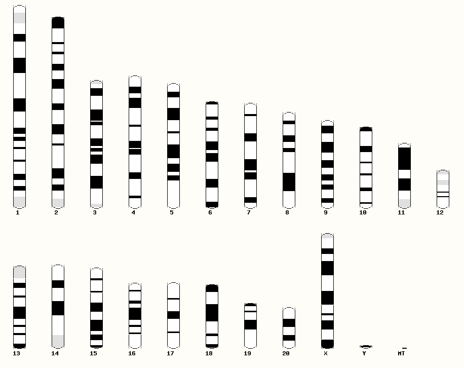

+ 下载基因组索引文件 - [**可选**]

在`hisat2` 官网上可以找到现成的已经建立好索引的大鼠基因组文件，如果电脑配置一般建议直接下载好索引文件，可以直接下载这个索引文件（因为建立索引文件时间较长1个小时以上）

```bash
$ cd ~/project/rat/genome
$ wget ftp://ftp.ccb.jhu.edu/pub/infphilo/hisat2/data/rn6.tar.gz
$ gzip -d rn6.tar.gz
```
+ 下载注释信息

```bash
$ cd ~/project/rat/annotation
$ wget ftp://ftp.ensembl.org/pub/release-97/gtf/rattus_norvegicus/Rattus_norvegicus.Rnor_6.0.97.gtf.gz
$ gzip -d Rattus_norvegicus.Rnor_6.0.97.gtf.gz

# 同样的也改名
$ mv Rattus_norvegicus.Rnor_6.0.97.gtf rn6.gff

# 使用head查看部分
$ head rn6.gff
```

> **注释数据说明**
> 
> 注释`gff`文件的样例：
> 
> ```
> #!genome-build Rnor_6.0
> #!genome-version Rnor_6.0
> #!genome-date 2014-07
> #!genome-build-accession NCBI:GCA_000001895.4
> #!genebuild-last-updated 2017-01
> 1	ensembl_havana	gene	396700	409750	.	+	.	gene_id "ENSRNOG00000046319"; gene_version "4"; gene_name "AABR07000046.1"; gene_source "ensembl_havana"; gene_biotype "processed_transcript";
> 1	ensembl	transcript	396700	409676	.	+	.	gene_id "ENSRNOG00000046319"; gene_version "4"; transcript_id "ENSRNOT00000044187"; transcript_version "4"; gene_name "AABR07000046.1"; gene_source "ensembl_havana"; gene_biotype "processed_transcript"; transcript_name "AABR07000046.1-202"; transcript_source "ensembl"; transcript_biotype "processed_transcript";
> 1	ensembl	exon	396700	396905	.	+	.	gene_id "ENSRNOG00000046319"; gene_version "4"; transcript_id "ENSRNOT00000044187"; transcript_version "4"; exon_number "1"; gene_name "AABR07000046.1"; gene_source "ensembl_havana"; gene_biotype "processed_transcript"; transcript_name "AABR07000046.1-202"; transcript_source "ensembl"; transcript_biotype "processed_transcript"; exon_id "ENSRNOE00000493937"; exon_version "1";
> ```
>
> gff文件开头描述了这个注释数据的基本信息，比如版本号，更新时间，组装的NCBI的Assembly编号等等，后面每一行表示描述信息，说明了在哪条染色体的什么位置是什么东西。比如第6行的表示在1号染色体正链上 396700-409750 这个范围内有一个基因编号为ENSRNOG00000046319的基因

### 3.2 测试数据（实验数据）

为了进行演示，从NCBI上查找相关的`RNA-seq`数据进行下载，在GEO数据库中找了一个数据`GSE72960`，对应的SRP数据为`SRP063345`，对应的文献是：

[肝硬化分子肝癌的器官转录组分析和溶血磷脂酸途径抑制 - 《Molecular Liver Cancer Prevention in Cirrhosis by Organ Transcriptome Analysis and Lysophosphatidic Acid Pathway Inhibition》](https://www.ncbi.nlm.nih.gov/pmc/articles/PMC5161110/)

+ 首先进入站点[NCBI - GEO](https://www.ncbi.nlm.nih.gov/geo)，然后在搜索框中输入`GSE72960`，之后在下方出现了这个基因表达数据集的描述信息，比如样本提交日期，样本文献来源，数据提交人的信息，样本测序样本数量，对应的编号等等。


+ 我们直接点击最下面的`SRA Run selector`这个里面包含了这8个测序样本的测序信息以及文件`SRA编号`，通过这个编号就可以下载测序数据。

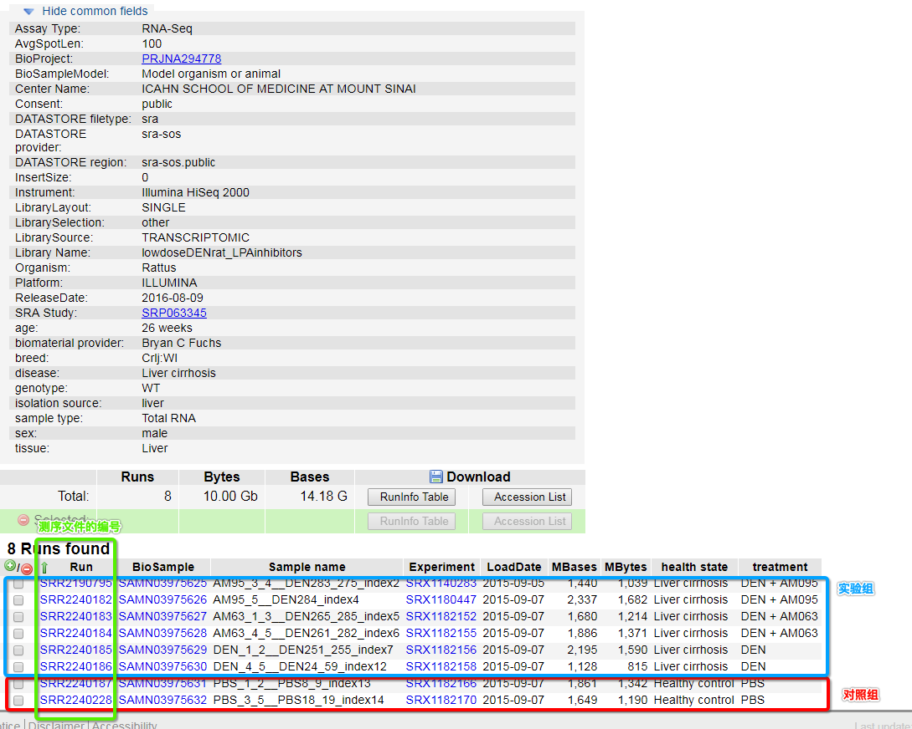

+ 将刚才在`Run selector`中查找到的数据的编号复制下来，之后下载测序数据，下载脚本如下，这里是采用`SRAtoolkit`工具包中的`prefetch`工具，如果部分数据下载失败，那么再次执行下面的代码。

```bash
# 后台下载
$ nohup prefetch SRR2190795 SRR224018{2..7} SRR2240228 -o . &
```
+ 下载完成之后并不是之前说的`.fastq.gz`格式的文件，而是`.sra`文件，这里进行格式转换，这里还是使用`SRAtoolkit`工具包，但是是里面的`fastq-dump`工具，使用它来进行格式转化

```bash
# 将sra文件转化为fastq文件之后压缩为gz文件

# --gzip 把生成的fastq文件压缩为gz格式，节省内存
$ parallel -j 4 "
    fastq-dump --split-3 --gzip {1}
" ::: $(ls *.sra)

# 删除sra文件
$ rm *.sra
```
> **fastq格式介绍**
> ```bash
>    $ cd ~/project/rat/sequence
>    $ gzip -d -c SRR2190795.fastq.gz | head -n 20
> ```
> 
> @SRR2190795.1 HWI-ST1147:240:C5NY7ACXX:1:1101:1320:2244 length=100
> ATGCTGGGGGCATTAGCATTGGGTACTGAATTATTTTCAGTAAGAGGGAAAGAATCCATCTCCNNNNNNNNNNNNNNNNNNNNNNAAANAAAAATAAAAT
> +SRR2190795.1 HWI-ST1147:240:C5NY7ACXX:1:1101:1320:2244 length=100
> CCCFFFFFHHHHHJIJJJJJJJJDHHJJJIJJJJJIJJJJJJJJJJJJJJJJJJJJJJJJJHH#####################################
> @SRR2190795.2 HWI-ST1147:240:C5NY7ACXX:1:1101:1598:2247 length=100
> AACTTCGGTTCTCTACTAGGAGTATGCCTCATAGTACAAATCCTCACAGGCTTATTCCTAGCANNNNNNNNNNNNNNNNNNNNNNTAACAGCATTTTCAT
> +SRR2190795.2 HWI-ST1147:240:C5NY7ACXX:1:1101:1598:2247 length=100
> @@@7D8+@A:1CFG<C:23<:E<;FF<BHIIEHG:?:??CDF<9DCGGG?1?FEG@@<@CA#######################################
> @SRR2190795.3 HWI-ST1147:240:C5NY7ACXX:1:1101:1641:2250 length=100
> AGAAGGTCTTAGATCAGAAGGAGCACAGACTGGATGGTCGTGTCATTGACCCTAAAAAGGCTANNNNNNNNNNNNNNNNNNNNNTGAAGAAAATCTTTGT
> +SRR2190795.3 HWI-ST1147:240:C5NY7ACXX:1:1101:1641:2250 length=100
> BC@FFFDDHHHHHJJJJJJJJJJJJJJJJJJJJIJJJFHGHHEGHIIIHJIJJIJJIJIJJID#####################################
> @SRR2190795.4 HWI-ST1147:240:C5NY7ACXX:1:1101:1851:2233 length=100
> GGGATTTCATGGCCTCCACGTAATTATTGGCTCAACTTTCCTAATTGTCTGTCTACTACGACANNNNNNNNNNNNNNNNNNNNNNNNNNNNNNTNNCNNN
> +SRR2190795.4 HWI-ST1147:240:C5NY7ACXX:1:1101:1851:2233 length=100
> @@?DDBDDFFDDDGHGGGGI?B;FFHGHA@FEHGHDDGHEGGFGHIGEHIIHIGGBGACD6AH#####################################
> @SRR2190795.5 HWI-ST1147:240:C5NY7ACXX:1:1101:1957:2243 length=100
> CAGCCATTGTGGCTCCCGATGGCTTTGACATCATTGACATGACAGCCGGAGGTCAGATAAACTNNNNNNNNNNNNNNNNNNNNNNATCNGTGGCAAAGGT
> +SRR2190795.5 HWI-ST1147:240:C5NY7ACXX:1:1101:1957:2243 length=100
> @CCFFFFFHHHHAHJJJIJJJJJJIJJIGGGIFIJIIHIIGGJJJJJJJFHIGIJHHHHHHFC#####################################
>

## 4. 质量控制

### 4.1 质量评估

拿到测序数据文件，在序列比对之前需要对测序文件的测序质量进行查看，因为不同测序数据来源测序质量也不一样，为了保证后续分析的有效性和可靠性，需要对质量进行评估，如果数据很差那么在后续分析的时候就需要注意了。这里使用`fastqc`进行质量评估

+ 用法

```bash
fastqc [选项] [测序文件]
```
+ 实际使用

```bash
$ cd ~/project/rat/sequence

# 因为程序不会自动新建目录，这里新建一个目录
$ mkdir -p ../output/fastqc

# -t 指定线程数
# -o 指定输出文件夹
# *.gz 表示这个目录下以 .gz 的所有文件
$ fastqc -t 6 -o ../output/fastqc *.gz
```
运行过程中会出现分析的进程，在分析完成之后会有分析报告生成。

```bash
$ cd ~/project/rat/output/fastqc
$ ls

SRR2190795_fastqc.html SRR2240184_fastqc.html SRR2240187_fastqc.html
SRR2190795_fastqc.zip  SRR2240184_fastqc.zip  SRR2240187_fastqc.zip
SRR2240182_fastqc.html SRR2240185_fastqc.html SRR2240228_fastqc.html
SRR2240182_fastqc.zip  SRR2240185_fastqc.zip  SRR2240228_fastqc.zip
SRR2240183_fastqc.html SRR2240186_fastqc.html
SRR2240183_fastqc.zip  SRR2240186_fastqc.zip
```
这里的`.html`用浏览器打开，查看一下情况，

可以看到这个测序质量不是特别好，

有关fastq的报告解读，这里有一篇文章写的可以[用FastQC检查二代测序原始数据的质量](https://www.plob.org/article/5987.html)

> 绿色表示通过，红色表示未通过，黄色表示不太好。一般而言RNA-Seq数据在sequence deplication levels 未通过是比较正常的。毕竟一个基因会大量表达，会测到很多遍。

这里因为有多份报告，有时候查看不是特别方便，这里有一个将所有的fastqc的检测报告合并到一个文件上的程序`multiqc`

```bash
$ cd ~/project/rat/output/fastqc

$ multiqc .
```
主要看几个图

+ 平均GC含量

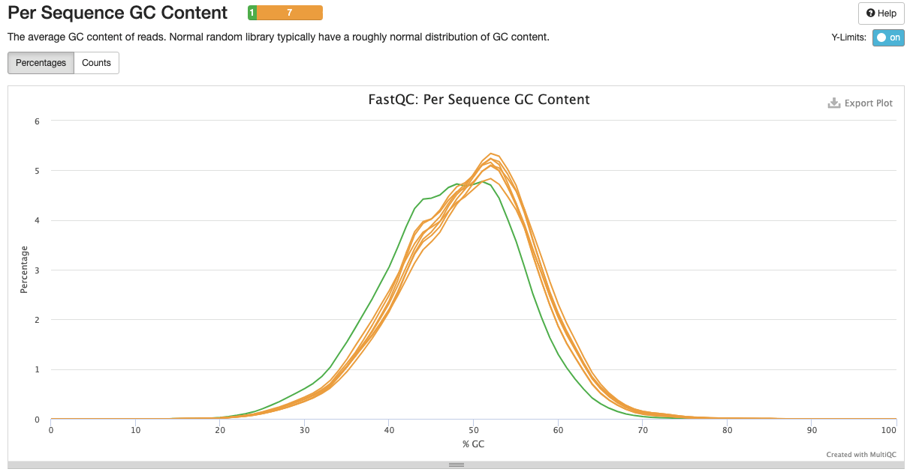

大体上查看一下测序的总的GC含量，GC含量说明了当前测序是否有很大问题，如果偏差较大，那么可能出现偏测序偏好性（绿色线是理论值，黄色线是实际的情况），因为是转录组，所以可能出现部分序列偏多的情况，这里没有特别大的差异。

+ 所有的测序文件的质量

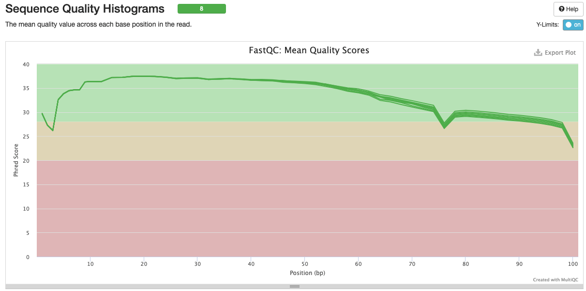

在开头10bp之内和70bp之后，出现了质量值低于30的情况，这个时候说明测序的序列两端的部分序列质量可能一般，需要进行剔除。

+ 查看平均质量值的read的数量

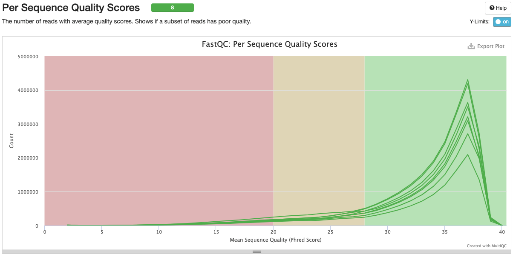

在平均质量低于20的read处可以看到有曲线存在，这个说明其中存在质量很低的read，后续需要进行剔除

+ 查看接头情况

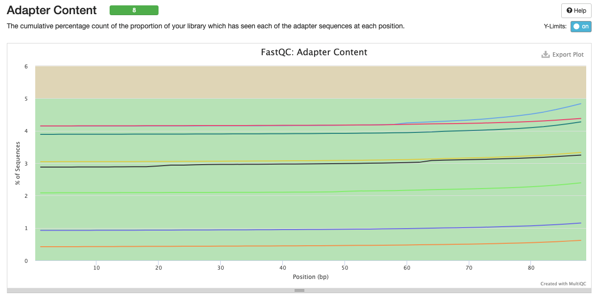

显示为通过，但是有部分可能包含有几个碱基的接头序列，为了保险也进行一步接头剔除。

### 4.2 剔除接头以及测序质量差的碱基

上面看到，在接头那里是显示的通过，但是可以看到有部分是有4个碱基与接头序列匹配的，属于Illumina的通用接头。另外也可以看到，除了可能存在接头的情况，在测序质量那里也可以看到在`5'`端存在低质量的测序区域，所以像两端这种低质量的区域也是要去除的的，这一步采用`trimmomatic`进行。

```bash
$ cd ~/project/rat/sequence
# 新建文件夹
$ mkdir -p ../output/adapter/

# 循环处理文件夹下的
$ for i in $(ls *.fastq.gz);
do
    # --minimum-length 如果剔除接头后read长度低于30，这条read将会被丢弃
    # --overlap        如果两端的序列与接头有4个碱基的匹配将会被剔除
    # --trim-n         剔除两端的N
    cutadapt -a AATGATACGGCGACCACCGAGATCTACACTCTTTCCCTACACGACGCTCTTCCGATCT \
    --minimum-length 30 --overlap 4 --trim-n \
    -o ../output/adapter/${i}  ${i}
done
```
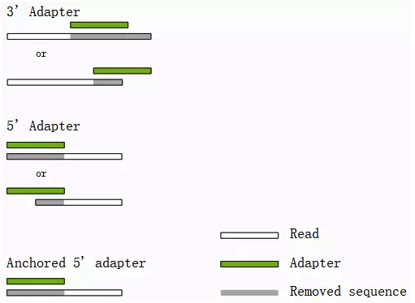

### 4.4 再次去除低质量区域

```bash
$ cd ~/project/rat/output/adapter/
$ mkdir ../trim

$ parallel -j 4 "
  # LEADING:20，从序列的开头开始去掉质量值小于 20 的碱基
  # TRAILING:20，从序列的末尾开始去掉质量值小于 20 的碱基
  # SLIDINGWINDOW:5:15，从 5' 端开始以 5bp 的窗口计算碱基平均质量，如果此平均值低于 15，则从这个位置截断read
  # MINLEN:36， 如果 reads 长度小于 30bp 则扔掉整条 read。
  java -jar ~/Applications/biosoft/Trimmomatic-0.38/trimmomatic-0.38.jar \
    SE -phred33 {1} ../trim/{1} \
    LEADING:20 TRAILING:20 SLIDINGWINDOW:5:15 MINLEN:30 \
" ::: $( ls *.gz)
```
### 4.3 再次查看质量情况

```bash
$ cd ~/project/rat/output/trim

$ mkdir ../fastqc_trim
$ parallel -j 4 "
    fastqc -t 4 -o ../fastqc_trim {1}
" ::: $(ls *.gz)

$ cd ../fastqc_trim
$ multiqc .
```
相对于上面的情况，现在好多了

## 5. 去除rRNA序列

如果在提取RNA过程中没有对RNA进行筛选的情况下，那么得到的大部分将会是`rRNA`，这个对于后续的分析可能会存在影响，另外也会让比对的时间变长。

> **注意**：在使用`sortmerna`的时候需要确保测序文件是**未压缩的文件**

```bash
$ cd ~/project/rat/output
$ mkdir -p ./rRNA/discard

$ cd trim

$ parallel -j 4 "
  # 解压测序文件
  gzip -d {1}*.fq.gz
  
  # euk_rNRA_ref_data就是之前安装sortmerna的时候定义的数据库文件
  # --reads  : 测序文件
  # --aligned: 与rRNA数据库能比对上的序列(后续不需要的)
  # --other  : 与rRNA数据库不能比对上的序列(后续需要的)
  # --fastx  : 输出fastq文件
  # --log    : 生成日志文件
  # -a       : 线程数
  # -v       : 吵闹模式
  
  # 注意--aligned和--other后接文件名前缀，不用在加什么 .fq 或者 .fastq之类的，否则将会生成 xxx.fq.fq
  sortmerna \
    --ref $euk_rNRA_ref_data \
    --reads {1}*.fq \
    --aligned ../rRNA/discard/{1} \
    --other ../rRNA/{1} \
    --fastx \
    --log \
    -a 4 \
    -v
  
  # 压缩fastq文件
  gzip ../rRNA/{1}.fq
  gzip ../rRNA/discard/{1}.fq
" ::: $(ls *.fq.gz | perl -n -e 'print $1."\n" if m/(.+?)_/')
```

## 6. 序列比对

得到干净的测序数据之后，

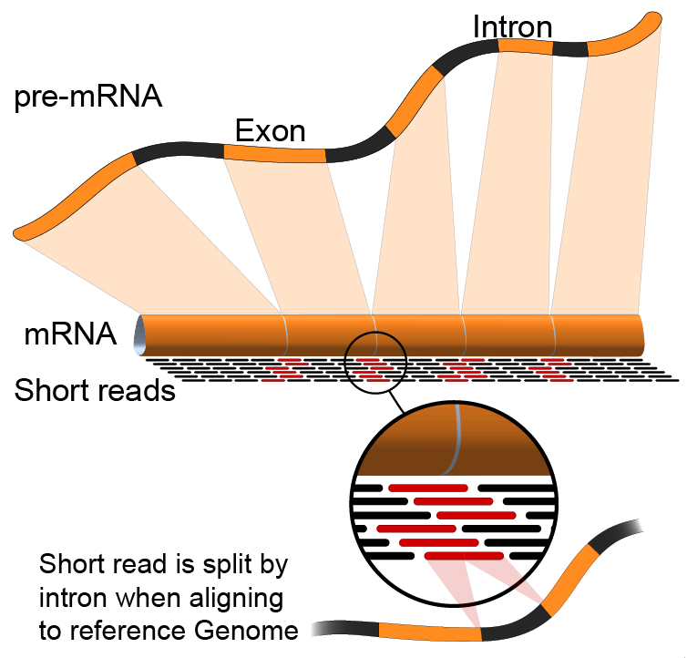

### 6.1 建立索引

这一步使用`hisat2`中的工具`hisat2-build`建立索引。

+ 用法

```
hisat2-build [选项] [基因组序列(.fa)] [索引文件的前缀名]
```
+ 开始使用

```bash
$ cd ~/project/rat/genome
$ mkdir index
$ cd index

$ hisat2-build  -p 6 ../rn6.fa rn6
```
在运行过程中会有部分信息提示，其中说到建立索引文件的分块情况以及运行时间的统计

索引建立完成之后在`~/project/rat/genome`文件夹下会出现

```
rn6.1.ht2
rn6.2.ht2
rn6.3.ht2
rn6.4.ht2
rn6.5.ht2
rn6.6.ht2
rn6.7.ht2
rn6.8.ht2
```
8个文件，这些文件是对基因组进行压缩之后的文件，这个将基因组序列数据分块成了8份，在执行序列比对的时候直接使用这些文件而不是基因组`rn6.fa`文件。


### 6.2  开始比对

这里使用hasat2进行比对

+ 用法

```bash
hisat2 [选项] -x [索引文件] [ -1 1测序文件 -2 2测序文件 -U 未成对测序文件 ] [ -S 输出的sam文件 ]
```
+ 实际使用

```bash
$ cd ~/project/rat/output

$ mkdir align
$ cd rRNA

$ parallel -k -j 4 "
    hisat2 -t -x ../../genome/index/rn6 \
      -U {1}.fq.gz -S ../align/{1}.sam \
      2>../align/{1}.log
" ::: $(ls *.gz | perl -p -e 's/.fq.gz$//')
```
比对完成之后可以进入文件夹查看一下日志信息

```bash
$ cd ~/project/rat/output/align

$ cat SRR2190795.log
```

```
Time loading forward index: 00:00:17
Time loading reference: 00:00:04
Multiseed full-index search: 00:18:59
14998487 reads; of these:
  14998487 (100.00%) were unpaired; of these:
    1350172 (9.00%) aligned 0 times
    12410890 (82.75%) aligned exactly 1 time
    1237425 (8.25%) aligned >1 times
91.00% overall alignment rate
Time searching: 00:19:25
Overall time: 00:19:42
```

日志信息中说到了比对花费的时间以及比对情况。这里可以看到`91.00%`的比对率，比率还可以。

+ 总结比对情况

```bash
cd ~/project/rat/output/align
file_list=($(ls *.log))

echo -e "sample\tratio\ttime"
for i in ${file_list[@]};
do
    prefix=$(echo ${i} | perl -p -e 's/\.log//')
    echo -n -e "${prefix}\t"
    cat ${i} |
      grep -E "(overall alignment rate)|(Overall time)" |
      perl -n -e '
        if(m/alignment/){
          $hash{precent} = $1 if m/([\d.]+)%/;
        }elsif(m/time/){
          if(m/(\d\d):(\d\d):(\d\d)/){
            my $time = $1 * 60 + $2 + $3 / 60;
            $hash{time} = $time;
          }
        }
        END{
          $hash{precent} = "NA" if not exists $hash{precent};
          $hash{time} = "NA" if not exists $hash{time};
          printf "%.2f\t%.2f\n", $hash{precent}, $hash{time};
        }
      '
done
```

+ 格式转化与排序

SAM格式是目前用来存放大量核酸比对结果信息的通用格式，也是人类能够“直接”阅读的格式类型，而BAM和CRAM是为了方便传输，降低存储压力将SAM进行压缩得到的格式形式。


```bash
$ cd ~/project/rat/output/align
$ parallel -k -j 4 "
    samtools sort -@ 4 {1}.sam > {1}.sort.bam
    samtools index {1}.sort.bam
" ::: $(ls *.sam | perl -p -e 's/\.sam$//')

$ rm *.sam

$ ls
```

```
SRR2190795.log          SRR2240185.log
SRR2190795.sort.bam     SRR2240185.sort.bam
SRR2190795.sort.bam.bai SRR2240185.sort.bam.bai
SRR2240182.log          SRR2240186.log
SRR2240182.sort.bam     SRR2240186.sort.bam
SRR2240182.sort.bam.bai SRR2240186.sort.bam.bai
SRR2240183.log          SRR2240187.log
SRR2240183.sort.bam     SRR2240187.sort.bam
SRR2240183.sort.bam.bai SRR2240187.sort.bam.bai
SRR2240184.log          SRR2240228.log
SRR2240184.sort.bam     SRR2240228.sort.bam
SRR2240184.sort.bam.bai SRR2240228.sort.bam.bai
```

## 7. 表达量统计


使用HTSEQ-count - [htseq的使用方法和计算原理](https://htseq.readthedocs.io/en/master/count.html#)

如何判断一个 reads 属于某个基因， htseq-count 提供了 union, intersection_strict,intersection_nonempty 3 种模型，如图（大多数情况下作者推荐用 union 模型）


+ 用法

```bash
htseq-count [options] <alignment_files> <gff_file>
```

+ 参数说明

| 参数 | 说明 |
| --- | --- |
| -f --format | default: sam 设置输入文件的格式，该参数的值可以是sam或bam。|
| -r --order | default: name 设置sam或bam文件的排序方式，该参数的值可以是name或pos。前者表示按read名进行排序，后者表示按比对的参考基因组位置进行排序。若测序数据是双末端测序，当输入sam/bam文件是按pos方式排序的时候，两端reads的比对结果在sam/bam文件中一般不是紧邻的两行，程序会将reads对的第一个比对结果放入内存，直到读取到另一端read的比对结果。因此，选择pos可能会导致程序使用较多的内存，它也适合于未排序的sam/bam文件。而pos排序则表示程序认为双末端测序的reads比对结果在紧邻的两行上，也适合于单端测序的比对结果。很多其它表达量分析软件要求输入的sam/bam文件是按pos排序的，但HTSeq推荐使用name排序，且一般比对软件的默认输出结果也是按name进行排序的。|
| -s --stranded | default: yes 设置是否是链特异性测序。该参数的值可以是yes,no或reverse。no表示非链特异性测序；若是单端测序，yes表示read比对到了基因的正义链上；若是双末端测序，yes表示read1比对到了基因正义链上，read2比对到基因负义链上；reverse表示双末端测序情况下与yes值相反的结果。根据说明文件的理解，一般情况下双末端链特异性测序，该参数的值应该选择reverse（本人暂时没有测试该参数）。|
| -a --a | default: 10 忽略比对质量低于此值的比对结果。在0.5.4版本以前该参数默认值是0。|
| -t --type | default: exon 程序会对该指定的feature（gtf/gff文件第三列）进行表达量计算，而gtf/gff文件中其它的feature都会被忽略。|
| -i --idattr | default: gene_id 设置feature ID是由gtf/gff文件第9列那个标签决定的；若gtf/gff文件多行具有相同的feature ID，则它们来自同一个feature，程序会计算这些features的表达量之和赋给相应的feature ID。|
| -m --mode | default: union 设置表达量计算模式。该参数的值可以有union, intersection-strict and intersection-nonempty。这三种模式的选择请见上面对这3种模式的示意图。从图中可知，对于原核生物，推荐使用intersection-strict模式；对于真核生物，推荐使用union模式。|
| -o --samout | 输出一个sam文件，该sam文件的比对结果中多了一个XF标签，表示该read比对到了某个feature上。|
| -q --quiet | 不输出程序运行的状态信息和警告信息。|
| -h --help | 输出帮助信息。|

```bash
cd ~/project/rat/output
mkdir HTseq

cd align
parallel -j 4 "
    htseq-count -s no -f bam {1}.sort.bam ../../annotation/rn6.gff \
      >../HTseq/{1}.count  2>../HTseq/{1}.log
" ::: $(ls *.sort.bam | perl -p -e 's/\.sort\.bam$//')
```

查看生成的文件

```
cd ~/project/rat/output/HTseq
cat SRR2190795.count | head -n 10
```

结果（第一列：基因的ID，第二列：read计数）

```
ENSRNOG00000000001	1
ENSRNOG00000000007	3
ENSRNOG00000000008	0
ENSRNOG00000000009	0
ENSRNOG00000000010	0
ENSRNOG00000000012	0
ENSRNOG00000000017	10
ENSRNOG00000000021	22
ENSRNOG00000000024	843
ENSRNOG00000000033	27
```

## 8. 合并表达矩阵

这里就是将下面的这种表合并为一张表，作为一个整体输入到后续分析的程序中

```
      样本1 |        样本2 |       样本3
基因1   x   | 基因1    x   | 基因1   x
基因2   x   | 基因2    x   | 基因2   x
基因3   x   | 基因3    x   | 基因3   x
基因4   x   | 基因4    x   | 基因4   x
```

合并为

```
      样本1   样本2  样本3
基因1   x      x      x
基因2   x      x      x
基因3   x      x      x
基因4   x      x      x
```

下面使用`R`语言中的`merge`将表格合并

```bash
rm(list=ls())
setwd("~/project/rat/output/HTseq")

# 得到文件样本编号
files <- list.files(".", "*.count")
f_lists <- list()
for(i in files){
    prefix = gsub("(_\\w+)?\\.count", "", i, perl=TRUE)
    f_lists[[prefix]] = i
}

id_list <- names(f_lists)
data <- list()
count <- 0
for(i in id_list){
  count <- count + 1
  a <- read.table(f_lists[[i]], sep="\t", col.names = c("gene_id",i))
  data[[count]] <- a
}

# 合并文件
data_merge <- data[[1]]
for(i in seq(2, length(id_list))){
    data_merge <- merge(data_merge, data[[i]],by="gene_id")
}

write.csv(data_merge, "merge.csv", quote = FALSE, row.names = FALSE)
```

## 9. 差异表达分析

+ 查看几个管家基因的表达量情况。

`GAPDH(ENSRNOG00000018630)`、`beta-actin(ENSRNOG00000034254)`

```bash
cd ~/project/rat/output/HTseq

cat merge.csv | grep -E "ENSRNOG00000018630|ENSRNOG00000034254"
```
这是两个基因的表达量情况
```
ENSRNOG00000018630,2821,8092,4810,5813,8320,4161,3426,3249
ENSRNOG00000034254,5073,13386,5774,8791,16865,7583,4494,4860
```
### 9.1 数据前处理

DESeq2包是基于原始的read的计数，这里不需要进行标准化
进行分析

```R
dataframe <- read.csv("merge.csv", header=TRUE, row.names = 1)
```
在数据中存在总结的项，这些项对于后续分析有影响，这里删除掉

```
                       SRR2190795 SRR2240182 SRR2240183 SRR2240184
__alignment_not_unique    1237425    1821001    1327114    1554701
__ambiguous                237874     419677     260420     328308
__no_feature              1331291    1927193    1435345    1475574
__not_aligned             1350172    2317888    1262136     963510
__too_low_aQual                 0          0          0          0
ENSRNOG00000000001              1          2          0          1
                       SRR2240185 SRR2240186 SRR2240187 SRR2240228
__alignment_not_unique    1807092     962538    1703558    1436165
__ambiguous                364825     186332     336135     275106
__no_feature              2239366    1150812    1566965    1425114
__not_aligned             1336922    1027748    1734828    1539988
__too_low_aQual                 0          0          0          0
ENSRNOG00000000001              6          2          0          0
```

在HTseq-count的结果后面有5行总结的内容，分别是：

| 项                     | 说明                                   |
| ---------------------- | -------------------------------------- |
| __alignment_not_unique | 比对到多个位置的reads数                |
| __ambiguous            | 不能判断落在那个单位类型的reads数      |
| __no_feature           | 不能对应到任何单位类型的reads数        |
| __not_aligned          | 存在于SAM文件，但没有比对上的reads数   |
| __too_low_aQual        | 低于-a设定的reads mapping质量的reads数 |


```R
# 去除前面5行
countdata <- dataframe[-(1:5),]

# 查看数据
head(countdata)
```
有的时候在基因名后面会有`.1`或者`.2`等等的标号出现（这里没有），这个时候需要把它除去

```
# 得到行的名
row_names <- row.names(countdata)

# 开始替换
name_replace <- gsub("\\.\\w+","", row.names(countdata))

row.names(countdata) <- name_replace
```
到这里就得到了可以用于后续差异分析的数据了

### 9.2 差异分析

差异分析使用`DESeq2`包进行分析，这个对于输入的数据是原始的`read count`，所以上述经过`HTseq`的read计数之后的数据可以输入到`DESeq2`包中进行差异分析。

+ DESeq2的差异分析的步骤

> 1. **构建一个dds(DESeqDataSet)的对象**
> 2. **利用DESeq函数进行标准化处理**
> 3. **用result函数来提取差异比较的结果**

#### 9.2.1 安装与加载包

首先安装对应的R包

```R
# 使用bioconductor进行安装
source("http://bioconductor.org/biocLite.R")
options(BioC_mirror="http://mirrors.ustc.edu.cn/bioc/")

# 安装包
biocLite("DESeq2")
biocLite("pheatmap")
biocLite("biomaRt")
biocLite("org.Rn.eg.db")
biocLite("clusterProfiler")

# 加载
library(DESeq2)
library(pheatmap)
library(biomaRt)
library(org.Rn.eg.db)
library(clusterProfiler)
```
#### 9.2.2 构建对象

这里说白了就是把数据导入到R中生成对应的数据结构，它的基本用法如下：

```R
dds <- DESeqDataSetFromMatrix(countData = cts, colData = coldata, design= ~ batch + condition)
```
+ `countData（表达矩阵）`：是上面一步生成的一个数据框（列对应着每一个样本，行对应的基因名称，中间的值是read的计数），类似于下面的

|       | 样本1 | 样本2 | 样本3 | 样本4 |
| ----- | ----- | ----- | ----- | ----- |
| 基因1 | 10    | 20    | 15    | 16    |
| 基因2 | 0     | 0     | 2     | 2     |
| 基因3 | 120   | 110   | 20    | 10    |
| 基因4 | 40    | 44    | 10    | 20    |
| 基因5 | 20    | 10    | 13    | 12    |

+ `colData（样本信息）`：这个是用来描述样本的是实验组还是对照组，类似于下面

| sample      | treatment |
| ----------- | --------- |
| Control1    | control   |
| Control2    | control   |
| Experiment1 | treatment |
| Experiment2 | treatment |

+ `design（样本差异比较）`：就是指定样本依据什么分为实验组与对照组

上面的`表达矩阵`已经得到了，下面需要生成样本的信息，下面的表格我直接从NCBI的`Run selector`中得到。

| Run | BioSample | Sample name | Experiment | LoadDate | MBases | MBytes | health state | treatment |
| --- | --- | --- | --- | --- | --- | --- | --- | --- |
| [SRR2240185](https://www.ncbi.nlm.nih.gov/Traces/sra/?run=SRR2240185) | [SAMN03975629](https://www.ncbi.nlm.nih.gov/biosample/SAMN03975629) | DEN_1_2__DEN251_255_index7 | [SRX1182156](https://www.ncbi.nlm.nih.gov/sra/SRX1182156) | 2015-09-07 | 2,195 | 1,590 | Liver cirrhosis | DEN |
| [SRR2240186](https://www.ncbi.nlm.nih.gov/Traces/sra/?run=SRR2240186) | [SAMN03975630](https://www.ncbi.nlm.nih.gov/biosample/SAMN03975630) | DEN_4_5__DEN24_59_index12 | [SRX1182158](https://www.ncbi.nlm.nih.gov/sra/SRX1182158) | 2015-09-07 | 1,128 | 815 | Liver cirrhosis | DEN |
| [SRR2240187](https://www.ncbi.nlm.nih.gov/Traces/sra/?run=SRR2240187) | [SAMN03975631](https://www.ncbi.nlm.nih.gov/biosample/SAMN03975631) | PBS_1_2__PBS8_9_index13 | [SRX1182166](https://www.ncbi.nlm.nih.gov/sra/SRX1182166) | 2015-09-07 | 1,861 | 1,342 | Healthy control | PBS |
| [SRR2240228](https://www.ncbi.nlm.nih.gov/Traces/sra/?run=SRR2240228) | [SAMN03975632](https://www.ncbi.nlm.nih.gov/biosample/SAMN03975632) | PBS_3_5__PBS18_19_index14 | [SRX1182170](https://www.ncbi.nlm.nih.gov/sra/SRX1182170) | 2015-09-07 | 1,649 | 1,190 | Healthy control | PBS |

这个表格说明了样本`ID`及其处理的情况，可以看到就是`treatment`那一栏不一样，下面针对

表达数据已经有了，下面是写一下实验组与对照组的信息，打开终端，`cd`到相应位置

```bash
cat <<EOF >./phenotype/phenotype.csv
"ids","state","condition","treatment"
"SRR2240185","Liver cirrhosis","DEN","treatment"
"SRR2240186","Liver cirrhosis","DEN","treatment"
"SRR2240187","Healthy control","PBS","control"
"SRR2240228","Healthy control","PBS","control"
EOF
```

下面将这些数据导入到R中

```R
# 刚才countdata已经得到
countdata

# 读取样本分组信息(注意，需要加上row.names = 1, header = TRUE，将行列名需要看好)
coldata <- read.table("../phenotype/phenotype.csv", row.names = 1, header = TRUE, sep = "," )
# 确认一下行列名是否有（不是简单的数值）
head(coldata)
# 调整数据顺序
countdata <- countdata[row.names(coldata)]

# 构建dds对象
dds <- DESeqDataSetFromMatrix(countData = countdata, colData = coldata, design= ~ treatment)

# 查看dds
dds
```

```
class: DESeqDataSet 
dim: 32883 8 
metadata(1): version
assays(1): counts
rownames(32883): ENSRNOG00000000001 ENSRNOG00000000007 ...
  ENSRNOG00000062307 ENSRNOG00000062308
rowData names(0):
colnames(8): SRR2190795 SRR2240182 ... SRR2240187 SRR2240228
colData names(4): ids health.state condition treatment
```

#### 9.2.3 样本相关性

因为存在很多基因的差别等因素，在某些基因上可能样本间几乎没有差别，但是总体来看就会有较大差别了，这里对包含众多的基因这样的因素的情况下进行样本相关性进行评估，评估样本的重复组之间是否很相似或者是否实验组与对照组之间差别明显。

+ PCA分析(principal components analysis)

由于上面得到的是最原始的`read count`，但是PCA分析需要对数据进行转化才能进行。一般取对数，但是最原始的数据中有些基因的计数为`0`，这样在取`log`值的时候意味着`−∞`，这样是不行的，所以一般会加上一个常数再取`log`，也就是`log(count + N)`（其中`N`是一个常数），但是也有较好的方法来进行校正，比如`DEseq2`包自带的`vst`函数，全名为[`variance stabilizing transformation`](https://en.wikipedia.org/wiki/Variance-stabilizing_transformation)，它消除了方差对均值的依赖，尤其是低均值时的高`log counts`的变异。

```R
# 接续着上面的构建得到的dds对象
# DEseq2包提供了相应的函数
vsdata <- vst(dds, blind=FALSE)
# intgroup 分组
plotPCA(vsdata, intgroup="treatment")
```


距离越近相关性越大，否则越远，如果点单独的偏离，那么这个样本可能不好用。

+ sample-to-sample distances热图

上述的转换数据还可以做样本聚类热图，用`dist`函数来获得sample-to-sample距离，距离矩阵热图中可以清楚看到samples之间的相似与否

```R
# 颜色管理包（不是必须）
library("RColorBrewer")
# 得到数据对象中基因的计数的转化值
gene_data_transform <- assay(vsdata)
# 使用t()进行转置
# 使用dist方法求样本之间的距离
sampleDists <- dist(t(gene_data_transform))
# 转化为矩阵用于后续pheatmap()方法的输入
sampleDistMatrix <- as.matrix(sampleDists)
# 将矩阵的名称进行修改
# rownames(sampleDistMatrix) <- paste(vsdata$treatment, vsdata$condition, vsdata$ids, sep="-")
# colnames(sampleDistMatrix) <- paste(vsdata$treatment, vsdata$condition, vsdata$ids, sep="-")
# 设置色盘
colors <- colorRampPalette( rev(brewer.pal(9, "Blues")) )(255)
# 绘制热图与聚类
pheatmap(sampleDistMatrix,
         clustering_distance_rows=sampleDists,
         clustering_distance_cols=sampleDists,
         col=colors)
```

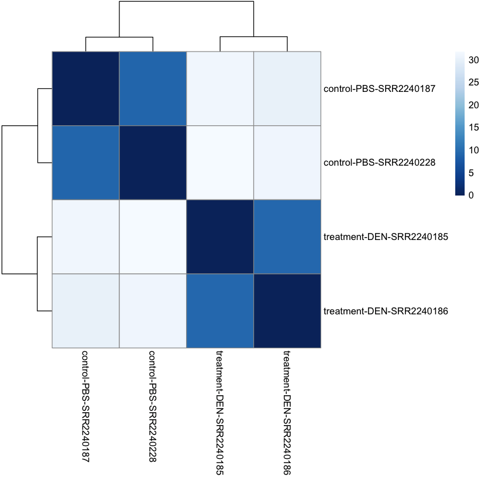

可以看到样本与样本之间的距离，颜色越深，距离越近。

> 如果实验组与对照组之间差别不明显，那么后续的分析结果就需要考虑一下。另外如果重复之间差异较大，那么在后续分析的时候就需要谨慎考虑了偏离的组别是否能被用于后续分析了

#### 9.2.4 差异基因

+ 使用`DESeq()`方法计算不同组别间的基因的表达差异，它的输入是上一步构建的`dss`数据对象

```R
# 改变样本组别顺序
dds$treatment <- factor(as.vector(dds$treatment), levels = c("control","treatment"))

# 基于统计学方法进行计算
dds <- DESeq(dds)
```

输出，下面的输出的说明了分析的过程

> 1. 估计样本大小（消除测序深度的影响）
>
> 2. 对每一个基因的表达量的离散度做计算
>
> 3. 拟合广义的线性模型（generalized linear model）

使用的`Wald test`

```
estimating size factors
estimating dispersions
gene-wise dispersion estimates
mean-dispersion relationship
final dispersion estimates
fitting model and testing
```

+ 查看实验组与对照组的对比结果

```R
result <- results(dds, pAdjustMethod = "fdr", alpha = 0.05)

# 查看结果
head(result)
```

```
log2 fold change (MLE): treatment treatment vs control 
Wald test p-value: treatment treatment vs control 
DataFrame with 6 rows and 6 columns
                             baseMean     log2FoldChange            lfcSE               stat            pvalue              padj
                            <numeric>          <numeric>        <numeric>          <numeric>         <numeric>         <numeric>
ENSRNOG00000000001   1.17994640466912   2.82050381813686 2.03998348785486   1.38261110196669 0.166784143097929                NA
ENSRNOG00000000007   3.21818763108968   1.03282812936483 1.19212587975669  0.866375058962425   0.3862845167692 0.588801446064814
ENSRNOG00000000008 0.0736487075696094 0.0408142674500467 4.08045162499813 0.0100023897354905 0.992019380733042                NA
ENSRNOG00000000009  0.315935819923557  0.945916209804408  3.9303577318638  0.240669240394016 0.809811480914061                NA
ENSRNOG00000000010   0.35792609721321   1.06599609220382  3.8132283198917  0.279552128217199  0.77982113929097                NA
ENSRNOG00000000012  0.319959749943513  0.992781336729426 3.27168216147163   0.30344675543998 0.761549418580228                NA
```

+ 将结果按照p-value进行排序

```R
result_order <- result[order(result$pvalue),]
head(result_order)
```

```
log2 fold change (MLE): treatment treatment vs control 
Wald test p-value: treatment treatment vs control 
DataFrame with 6 rows and 6 columns
                           baseMean    log2FoldChange             lfcSE              stat               pvalue                 padj
                          <numeric>         <numeric>         <numeric>         <numeric>            <numeric>            <numeric>
ENSRNOG00000011250 208.046881231885 -7.50369356010508  0.44485821990427 -16.8676068562245 7.78886122158816e-64 1.14472893373681e-59
ENSRNOG00000047945 3799.51961509786  4.50434780195392 0.358671277660941  12.5584290755837 3.57357467823096e-36 2.62604135229802e-32
ENSRNOG00000017897 1130.41206772961  4.41361091204456 0.353924586455456  12.4704840549416 1.08166978868575e-35 5.29910029477147e-32
ENSRNOG00000001466 542.805654192746  4.87418957369525 0.412058420866664  11.8288799035913 2.76810877295631e-32 1.01707236590347e-28
ENSRNOG00000014013 400.690803761036  2.83690340404308 0.246440071910237  11.5115345570764 1.15406329271928e-30 3.39225364261904e-27
ENSRNOG00000018371 705.943312960284  4.65111741552834  0.41021741987017  11.3381762700384  8.4895191640983e-30 2.07950771924588e-26
```

+ 总结基因上下调情况

```R
summary(result_order)
```

```
out of 19962 with nonzero total read count
adjusted p-value < 0.05
LFC > 0 (up)       : 2248, 11%
LFC < 0 (down)     : 1148, 5.8%
outliers [1]       : 31, 0.16%
low counts [2]     : 5234, 26%
(mean count < 2)
[1] see 'cooksCutoff' argument of ?results
[2] see 'independentFiltering' argument of ?results
```

可以看到，一共`2248`个基因上调；`1148`个基因下调，`31`个离群值

+ 查看显著的基因数量

```R
table(result_order$padj<0.05)
```

```
FALSE  TRUE 
11301  3396
```

+ 将数据保存起来

```R
# 新建文件夹
dir.create("../DESeq2")
write.csv(result, file="../DESeq2/results.csv")
```

## 10. 提取差异表达基因

### 名词解释

+ `Log2FC ` FC就是`Fold Change`就是倍数差异，就是将对照组与实验组的基因表达量的差别，一般将`Fold Change`等于2作为是否差异的临界点，那么对应的`Log2FC`就是`1`。 


将上述的数据

```R
# padj 小于0.05并且Log2FC大于1
diff_gene <- subset(result_order, padj < 0.05 & abs(log2FoldChange) > 1)

# 查看数据框的大小
dim(diff_gene)
```

```
[1] 2485    6
```

+ 把差异基因写入到文件中

```
dir.create("../DESeq2/")
write.csv(diff_gene, file="../DESeq2/difference.csv")
```

## 11. 差异表达基因注释

### 使用Y叔的`ClusterProfiler`对基因的ID进行

```R
# 首先安装ClusterProfiler
source("http://bioconductor.org/biocLite.R")
# 安装clusterProfiler包
biocLite("clusterProfiler")
# 这里我们分析的是大鼠，安装大鼠的数据库
biocLite("org.Rn.eg.db")

# 加载包
library(clusterProfiler)
library(org.Rn.eg.db)

# 得到基因ID(这个ID是Ensembl数据库的编号)
ensembl_gene_id <- row.names(diff_gene)

# 转换函数
ensembl_id_transform <- function(ENSEMBL_ID){
    # geneID是输入的基因ID，fromType是输入的ID类型，toType是输出的ID类型，OrgDb注释的db文件，drop表示是否剔除NA数据
    a = bitr(ENSEMBL_ID, fromType="ENSEMBL", toType=c("SYMBOL","ENTREZID"), OrgDb="org.Rn.eg.db")
    return(a)
}

# 开始转化
ensembl_id_transform(ensembl_gene_id)
```

使用`ClusterProfiler`包进行转化似乎有部分没有映射到，换`biomaRt`包试一下

### 使用`biomaRt`

```R
# 安装
biocLite("biomaRt")

# 加载
library("biomaRt")

# 选择数据库
mart <- useDataset("rnorvegicus_gene_ensembl", useMart("ENSEMBL_MART_ENSEMBL"))

# 得到基因ID(这个ID是Ensembl数据库的编号)
ensembl_gene_id <- row.names(diff_gene)
rat_symbols <- getBM(attributes=c("ensembl_gene_id","external_gene_name","entrezgene_id", "description"), filters = 'ensembl_gene_id', values = ensembl_gene_id, mart = mart)
```

+ 将基因矩阵与`symbols`合并

```R
# 生成用于合并的列
diff_gene$ensembl_gene_id <- ensembl_gene_id
# 将DESeq2对象转换为数据库
diff_gene_dataframe <- as.data.frame(diff_gene)
# 合并
diff_gene_symbols <- merge(diff_gene_dataframe, rat_symbols, by = c("ensembl_gene_id"))
```

+ 将数据存储起来

```R
write.table(result, "../stat/all_gene.tsv", sep="\t", quote = FALSE)
write.table(diff_gene_symbols, "../stat/diff_gene.tsv", row.names = F,sep="\t", quote = FALSE)
```

+ 统计样本的差异基因

```bash
echo -e "sample\tnum" > all_samples.tsv
for i in $(ls);
do
    if [ -d ${i} ];
    then
        prefix=$i
        diff_num=$(cat $i/diff_gene.tsv | tail -n+2 | wc -l)
        echo -e "${prefix}\t${diff_num}" >> all_samples.tsv
    fi
done
```

使用R绘图

```R
library(ggplot2)
data <- read.table("all_samples.tsv", header = T)

pdf("samples_diff_gene_num.pdf")
  ggplot(data=data, aes(x=sample, y=num, fill=sample)) +
  geom_bar(stat = "identity", position = "dodge") +
  labs(x = "samples",y = "num",title = "different gene number")
dev.off()
```


## 13. 数据可视化

+ MA图

> MA-plot (R. Dudoit et al. 2002) ，也叫 mean-difference plot或者Bland-Altman plot，用来估计模型中系数的分布。 X轴, the “A” （ “average”）；Y轴，the “M” （“minus”） – subtraction of log values is equivalent to the log of the ratio。
> M表示log fold change，衡量基因表达量变化，上调还是下调。A表示每个基因的count的均值。根据summary可知，low count的比率很高，所以大部分基因表达量不高，也就是集中在0的附近（log2(1)=0，也就是变化1倍）.提供了模型预测系数的分布总览。

```R
plotMA(result_order, ylim=c(-10,10))
```

## 14. 富集分析

+ 使用`clusterProfiler`进行富集分析

```R
# 接续着上面的结果
ensembl_gene_id <- row.names(diff_gene)

# 得到symbol
rat_symbols <- getBM(attributes=c("ensembl_gene_id","external_gene_name","entrezgene_id", "description"), filters = 'ensembl_gene_id', values = ensembl_gene_id, mart = mart)
diff_gene_ensembl_id <- rat_symbols$ensembl_gene_id
```

### 14.1 `Gene Ontology (GO)`分析

+ GO的三大类

| 类别                    | 说明     |
| ----------------------- | -------- |
| molecular function (MF) | 分子功能 |
| biological process (BP) | 生物过程 |
| cellular component (CC) | 细胞组成 |

在`clusterProfiler`包中有`enrichGO`方法就是用来进行GO富集的

```react
enrichGO     GO Enrichment Analysis of a gene set. Given a vector of genes, this
             function will return the enrichment GO categories after FDR control.
Usage:
  enrichGO(gene, OrgDb, keyType = "ENTREZID", ont = "MF", pvalueCutoff = 0.05, 
           pAdjustMethod = "BH", universe, qvalueCutoff = 0.2, minGSSize = 10, 
           maxGSSize = 500, readable = FALSE, pool = FALSE)
Arguments:
  gene                 a vector of entrez gene id.
  OrgDb                OrgDb
  keyType              keytype of input gene
  ont                  One of "MF", "BP", and "CC" subontologies or 'ALL'.
  pvalueCutoff         Cutoff value of pvalue.
  pAdjustMethod        one of "holm", "hochberg", "hommel", "bonferroni", "BH", "BY", "fdr", "none"
  universe             background genes
  qvalueCutoff         qvalue cutoff
  minGSSize            minimal size of genes annotated by Ontology term for testing.
  maxGSSize            maximal size of genes annotated for testing
  readable             whether mapping gene ID to gene Name
  pool                 If ont=’ALL’, whether pool 3 GO sub-ontologies
```

| 参数          | 说明                                                         |
| ------------- | ------------------------------------------------------------ |
| gene          | 差异基因对应的向量                                           |
| keyType       | 指定的gene的ID类型，一般都用ENTREZID，该参数的取值可以参考`keytypes(org.Hs.eg.db)`的结果 |
| OrgDb         | 该物种对应的org包的名字                                      |
| ont           | 代表GO的3大类别，`BP`, `CC`, `MF`                            |
| pAdjustMethod | 指定多重假设检验矫正的方法                                   |
| pvalueCutoff  | 对应的阈值                                                   |
| qvalueCutoff  | 对应的阈值                                                   |

参数需要指定正确，特别是`OrgDb`。

+ 开始GO分析


```R
ego_bp<-enrichGO(gene       = rat_symbols$entrezgene_id,
                 OrgDb      = org.Rn.eg.db,
                 keyType    = 'ENSEMBL',
                 ont        = "BP",
                 pAdjustMethod = "BH",
                 pvalueCutoff = 0.01,
                 qvalueCutoff = 0.05)
```

### 另外可以使用一个在线网站

## ========================================

`StringTie` + `Ballgown`是较新的RNA-seq的分析方法。但是其中出现部分一定会出现的情况不知如何解决。这个过程没有走完，有待解决（在用`StringTie`合并第一步的转录本的gff之后，后面了`MSTRG`等基因名称。这种名称是在`stringtie`合并样本`gff`文件的时候产生的，后续差异分析之后不知道如何对应回去？）

## ========================================

## 5. 表达量分析

StringTie

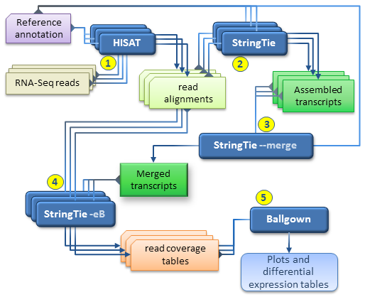

```bash
$ cd ~/project/rat/output
$ mkdir assembly

$ cd align
$ parallel -j 4 "
    stringtie -p 4 -G ../../annotation/rn6.gff -l {1} {1}.sort.bam -o ../assembly/{1}.gtf
" ::: $(ls *.sort.bam | perl -p -e 's/\.sort\.bam$//')
```
+ 查看一下新生成的`.gtf`文件

```bash
cd ~/project/rat/output/assembly

cat SRR2190795.gtf | head -n 4
```
可以看到使用StringTie处理后的注释文件与之前不一样了，在第九列里面出现了更多的描述信息，包括比对上的样本名，每个碱基的覆盖深度的平均数`cov`，表达量的标准化数值`TPM`和`FPKM`等等。

```bash
# stringtie -p 4 -G ../../annotation/rn6.gff -l SRR2190795 SRR2190795.sort.bam -o ../assembly/SRR2190795.gtf
# StringTie version 1.3.6
1	StringTie	transcript	1545134	1546169	1000	+	.	gene_id "SRR2190795.1"; transcript_id "SRR2190795.1.1"; reference_id "ENSRNOT00000044523"; ref_gene_id "ENSRNOG00000029897"; ref_gene_name "AABR07000156.1"; cov "0.192085"; FPKM "0.147392"; TPM "0.242629";
1	StringTie	exon	1545134	1546169	1000	+	.	gene_id "SRR2190795.1"; transcript_id "SRR2190795.1.1"; exon_number "1"; reference_id "ENSRNOT00000044523"; ref_gene_id "ENSRNOG00000029897"; ref_gene_name "AABR07000156.1"; cov "0.192085";
```
+ 合并`.gtf`文件

StringTie与之前的分析方式多了一步，这里将这些所有的样本的注释文件合并，在某种程度上根据比对的结果将那些没有出现在注释信息中的比对情况也进行了增补。

```bash
cd ~/project/rat/output/assembly

# 将生成 .gtf 文件的文件名放到文件中
ls *.gtf > mergelist.txt

##### 合并 ######
# --merge 合并模式
# -p 线程数
# -G 参考基因组的
stringtie --merge -p 8 -G ../../annotation/rn6.gff -o merged.gtf mergelist.txt 
```
参数--merge 为转录本合并模式。 在合并模式下，stringtie将所有样品的GTF/GFF文件列表作为输入，并将这些转录本合并/组装成非冗余的转录本集合。这种模式被用于新的差异分析流程中，用以生成一个**跨多个RNA-Seq样品的全局的、统一的转录本**。

接下来，重新组装转录本并估算基因表达丰度。

+ 估计转录本的丰度

```bash
$ cd ~/project/rat/output
$ mkdir abundance

$ cd align

$ parallel -j 4 "
    ../abundance/{1}
    stringtie -e -B -p 4 -G ../assembly/merged.gtf -l {1} {1}.sort.bam -o ../abundance/{1}/{1}.gtf
" ::: $(ls *.sort.bam | perl -p -e 's/\.sort\.bam$//')
```
+ 对比原始的注释文件，查看有哪些新发现的转录本

```bash
$ gffcompare 
```
+ 转化为表达量的矩阵

这里不用下游的`ballgown`进行分析，下载一个转换脚本，这个`python`脚本可以把之前生成的`.gtf`文件转换为表达量矩阵，这个脚本的下载方式是：

```bash
cd ~/project/rat/script

wget https://ccb.jhu.edu/software/stringtie/dl/prepDE.py

# 注意这个脚本是使用python2
python2 prepDE.py --help

cd ~/project/rat/output/
mkdir matrix

# 开始进行转换
python2 ~/project/rat/script/prepDE.py \
   -i ./abundance \
   -g ./matrix/gene_count_matrix.csv \
   -t ./matrix/transcript_count_matrix.csv \
   -l 100
```

到这里理一下文件夹，使用`tree`命令查看我们的目录结构

```bash
cd ~/project/rat

# -d 参数表示只显示文件夹
tree -d

.
├── annotation
├── genome
│   └── index
├── output
│   ├── abundance
│   │   ├── SRR2190795
│   │   ├── SRR2240182
│   │   ├── SRR2240183
│   │   ├── SRR2240184
│   │   ├── SRR2240185
│   │   ├── SRR2240186
│   │   ├── SRR2240187
│   │   └── SRR2240228
│   ├── adapter
│   ├── align
│   ├── assembly
│   │   ├── tmp.EpF0i246
│   │   └── tmp.bgxUpBmL
│   ├── fastqc
│   │   └── multiqc_data
│   ├── fastqc_trim
│   │   └── multiqc_data
│   ├── matrix
│   └── trim
├── phenotype
├── script
└── sequence
```

## 6. 表达量分析

在生物体中，不同部位、时间、不同处境下的基因表达情况是不一样的，这样在提取RNA并测序的时候，不同的RNA的存在量是不一样的，这个差异就导致了测序得到的read数量不同，基因表达越多，那么在组织中的存在越多，那么提取得到的量也就越多，最后测序测得的量也多。通过对RNA-seq的测序深度进行一个统计，就可以比较出基因的表达量，通过与特定的管家基因的表达量进行比较，就可以得出相对量从而判断上调还是下调。


在分析之前需要新建一个表型(phenotype)文件，这个文件是用来对样本记性描述的，下面是一个样例

```bash
"ids","sex","population"
"ERR188044","male","YRI"
"ERR188104","male","YRI"
"ERR188234","female","YRI"
"ERR188245","female","GBR"
"ERR188257","male","GBR"
"ERR188273","female","YRI"
"ERR188337","female","GBR"
"ERR188383","male","GBR"
"ERR188401","male","GBR"
"ERR188428","female","GBR"
"ERR188454","male","YRI"
"ERR204916","female","YRI"
```
这里我们创建一个类似的文件，在NCBI的`Run selector`中的表格

| Run | BioSample | Sample name | Experiment | LoadDate | MBases | MBytes | health state | treatment |
| --- | --- | --- | --- | --- | --- | --- | --- | --- |
| [SRR2190795](https://www.ncbi.nlm.nih.gov/Traces/sra/?run=SRR2190795) | [SAMN03975625](https://www.ncbi.nlm.nih.gov/biosample/SAMN03975625) | AM95_3_4__DEN283_275_index2 | [SRX1140283](https://www.ncbi.nlm.nih.gov/sra/SRX1140283) | 2015-09-05 | 1,440 | 1,039 | Liver cirrhosis | DEN + AM095 |
| [SRR2240182](https://www.ncbi.nlm.nih.gov/Traces/sra/?run=SRR2240182) | [SAMN03975626](https://www.ncbi.nlm.nih.gov/biosample/SAMN03975626) | AM95_5__DEN284_index4 | [SRX1180447](https://www.ncbi.nlm.nih.gov/sra/SRX1180447) | 2015-09-07 | 2,337 | 1,682 | Liver cirrhosis | DEN + AM095 |
| [SRR2240183](https://www.ncbi.nlm.nih.gov/Traces/sra/?run=SRR2240183) | [SAMN03975627](https://www.ncbi.nlm.nih.gov/biosample/SAMN03975627) | AM63_1_3__DEN265_285_index5 | [SRX1182152](https://www.ncbi.nlm.nih.gov/sra/SRX1182152) | 2015-09-07 | 1,680 | 1,214 | Liver cirrhosis | DEN + AM063 |
| [SRR2240184](https://www.ncbi.nlm.nih.gov/Traces/sra/?run=SRR2240184) | [SAMN03975628](https://www.ncbi.nlm.nih.gov/biosample/SAMN03975628) | AM63_4_5__DEN261_282_index6 | [SRX1182155](https://www.ncbi.nlm.nih.gov/sra/SRX1182155) | 2015-09-07 | 1,886 | 1,371 | Liver cirrhosis | DEN + AM063 |
| [SRR2240185](https://www.ncbi.nlm.nih.gov/Traces/sra/?run=SRR2240185) | [SAMN03975629](https://www.ncbi.nlm.nih.gov/biosample/SAMN03975629) | DEN_1_2__DEN251_255_index7 | [SRX1182156](https://www.ncbi.nlm.nih.gov/sra/SRX1182156) | 2015-09-07 | 2,195 | 1,590 | Liver cirrhosis | DEN |
| [SRR2240186](https://www.ncbi.nlm.nih.gov/Traces/sra/?run=SRR2240186) | [SAMN03975630](https://www.ncbi.nlm.nih.gov/biosample/SAMN03975630) | DEN_4_5__DEN24_59_index12 | [SRX1182158](https://www.ncbi.nlm.nih.gov/sra/SRX1182158) | 2015-09-07 | 1,128 | 815 | Liver cirrhosis | DEN |
| [SRR2240187](https://www.ncbi.nlm.nih.gov/Traces/sra/?run=SRR2240187) | [SAMN03975631](https://www.ncbi.nlm.nih.gov/biosample/SAMN03975631) | PBS_1_2__PBS8_9_index13 | [SRX1182166](https://www.ncbi.nlm.nih.gov/sra/SRX1182166) | 2015-09-07 | 1,861 | 1,342 | Healthy control | PBS |
| [SRR2240228](https://www.ncbi.nlm.nih.gov/Traces/sra/?run=SRR2240228) | [SAMN03975632](https://www.ncbi.nlm.nih.gov/biosample/SAMN03975632) | PBS_3_5__PBS18_19_index14 | [SRX1182170](https://www.ncbi.nlm.nih.gov/sra/SRX1182170) | 2015-09-07 | 1,649 | 1,190 | Healthy control | PBS |

样本除了健康状态与给药情况不同，其他均相同

```
cd ~/project/rat/output

mkdir phenotype

cat <<EOF >./phenotype/phenodata.csv
"ids","health state","treatment"
"SRR2190795","Liver cirrhosis","DEN + AM095"
"SRR2240182","Liver cirrhosis","DEN + AM095"
"SRR2240183","Liver cirrhosis","DEN + AM063"
"SRR2240184","Liver cirrhosis","DEN + AM063"
"SRR2240185","Liver cirrhosis","DEN"
"SRR2240186","Liver cirrhosis","DEN"
"SRR2240187","Healthy control","PBS"
"SRR2240228","Healthy control","PBS"
EOF
```

接下来就可以用R语言进行后续的分析了，打开`Rstudio`

```R
# 使用biocLite("ballgown")进行包的安装
source("http://bioconductor.org/biocLite.R")
options(BioC_mirror="http://mirrors.ustc.edu.cn/bioc/")

# 安装包
biocLite("ballgown")
biocLite("RSkittleBrewer")
biocLite("devtools")
biocLite("genefilter")
biocLite("dplyr")

# 读取表型文件

```
## 7. 差异表达分析

在这里发现了差异基因出现了`MSTRG`等名称。这个名称是在`stringtie`合并样本`gff`文件的时候产生的，后续差异分析之后不知道如何对应回去？


## 参考

### 流程

主要参考

+ [Y大宽 - RNA-seq(7): DEseq2筛选差异表达基因并注释(bioMart)](https://www.jianshu.com/p/3a0e1e3e41d0)
+ [Y大宽 - RNA-seq(8): 探索分析结果:Data visulization](https://www.jianshu.com/p/807cf4a969fb)
+ [Dawn_天鹏 - 转录组学习三（数据质控）](https://www.jianshu.com/p/bacb86c78b43) - fastqc结果解释的很好
+ [Dawn_天鹏 - 转录组学习七（差异基因分析）](https://www.jianshu.com/p/26511d3360c8)
+ [RNA-seq workflow: gene-level exploratory analysis and differential expression](https://master.bioconductor.org/packages/release/workflows/vignettes/rnaseqGene/inst/doc/rnaseqGene.html)

+ [RNAseq-workflow](https://github.com/twbattaglia/RNAseq-workflow)
+ [DESeq2分析转录组之预处理+差异分析](https://www.jianshu.com/p/309c35fa6c7f) - 样本对比关系设定

### 结果解读

+ [RNA-seq结果怎么才能看懂?答案全在这些图里---（2）基础分析结果篇](http://www.360doc.com/content/18/0307/18/45848444_735176770.shtml)

### 程序下载安装

+ [samtools的安装和使用](https://www.jianshu.com/p/6b7a442d293f)
+ [R与RStudio的安装](https://www.jianshu.com/p/1a0f25086e8b)
+ [高通量测序数据质控神器—Trimmomatic](https://www.plob.org/article/12130.html)
+ [HISAT+StringTie+Ballgown转录组分析流程介绍](https://www.jianshu.com/p/38c2406367d5)
+ [RNA-seq分析htseq-count的使用](https://www.cnblogs.com/triple-y/p/9338890.html)
+ [面面的徐爷 - RNA-seq数据分析---方法学文章的实战练习](https://www.jianshu.com/p/1f5d13cc47f8)
+ [biostar - Question: Phenotype data for Ballgown tool](https://biostar.usegalaxy.org/p/23253/)
+ [RNA Sequencing](http://www.yourgene.com.tw/content/messagess/contents/655406000360260030/) - 图片
+ [biostar - Question: Stringtie prepDE.py Error line 32](https://www.biostars.org/p/306894/) - prepDE.py脚本出错
+ [生信技能树 - biomart](https://www.jianshu.com/p/0dbd5528ce3d) - biomart用法（中文解读中最为详细的）
+ [Question: 98.21% of input gene IDs are fail to map](https://www.biostars.org/p/296321/) - 使用`ClusterProfiler`包可能会出现`input gene IDs are fail to map`就是部分基因没有对应到数据库中

### 问题

**Q：How to deal with MSTRG tag without relevant gene name?**

  + **A：[Question: How to deal with MSTRG tag without relevant gene name?](https://www.biostars.org/p/282817/)** - 在用stringtie的时候后续合并完成会生成`MSTRG`标签的基因名，怎么解决

**Q：RNA-seq应该去除PCR重复吗？**

  + **A: [Should I remove PCR duplicates from my RNA-seq data?](https://dnatech.genomecenter.ucdavis.edu/faqs/should-i-remove-pcr-duplicates-from-my-rna-seq-data/)**

  + **A: [The trouble with PCR duplicates](https://www.molecularecologist.com/2016/08/the-trouble-with-pcr-duplicates/)**

  + **A: [Removing PCR duplicates in RNA-seq Analysis](https://bioinformatics.stackexchange.com/questions/2282/removing-pcr-duplicates-in-rna-seq-analysis)**

  + **A: [《The impact of amplification on differential expression analyses by RNA-seq》](https://www.nature.com/articles/srep25533)**

**Q： DEseq2在进行差异分析时，组别之间重复数量不一样可以进行比较吗？**

  + **A：[Question: Deseq2 Etc. Unequal Sample Sizes](https://www.biostars.org/p/90421/)**

**Q：RNA-seq多少个重复比较合适？**

  + **A：[RNA测序中多少生物学重复合适](http://www.sohu.com/a/248181085_769248)** - 出于科研经费和实验结果准确性的综合考虑，RNA测序中每组至少使用6个生物学重复。若实验目的是鉴定所有倍数变化的差异基因，至少需要12个生物学重复。

